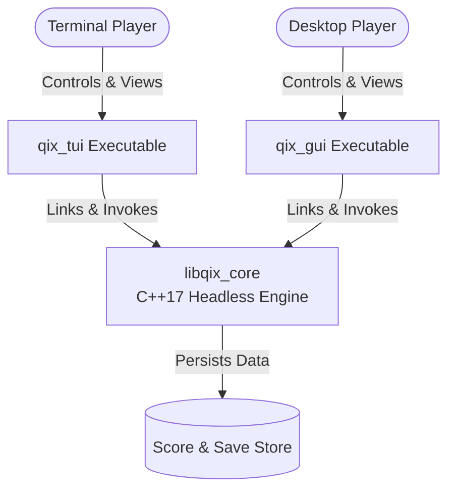
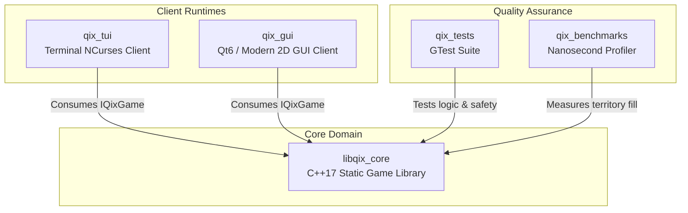
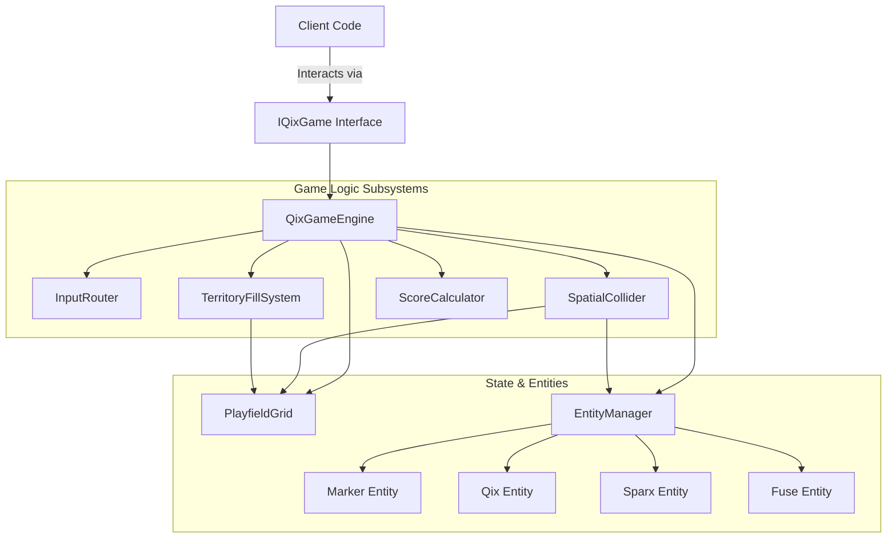
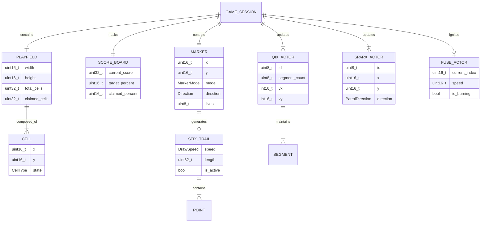
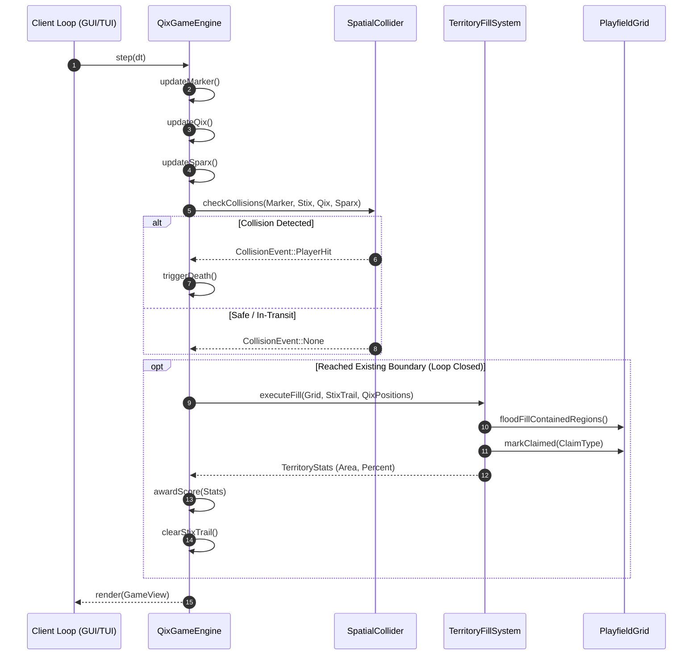

# Architecture Design: C++17 Qix Game Engine & Clients

This document defines the architectural design, C4 model hierarchy, and Entity-Relationship Model (ERD) for the **Qix Game Engine**. The system separates game logic, spatial calculation, and territory evaluation into a headless core library (`libqix_core`), decoupled from client renderers (GUI, TUI).

---

## 1. C4 Level 1: System Context

The System Context diagram describes the boundary of the Qix Game suite, external human players, and terminal/graphical display devices.

### ASCII Diagram

```
+--------------------+                       +--------------------+
|    TUI Player      |                       |     GUI Player     |
| (Terminal Console) |                       | (Window / Desktop) |
+---------+----------+                       +---------+----------+
          |                                            |
          | Keyboard / ANSI                            | Mouse / Keys / Render
          v                                            v
+-----------------------------------------------------------------+
|                    Qix Game Solution Suite                      |
|                                                                 |
|   +---------------------+             +---------------------+   |
|   |   qix_tui (Client)  |             |   qix_gui (Client)  |   |
|   +----------+----------+             +----------+----------+   |
|              |                                   |              |
|              +-----------------+-----------------+              |
|                                | Calls API                      |
|                                v                                |
|             +--------------------------------------+            |
|             |      libqix_core (Game Library)      |            |
|             +--------------------------------------+            |
+--------------------------------+--------------------------------+
                                 |
                                 v Filesystem I/O
                      +--------------------+
                      | High Scores & Save |
                      |    (JSON / Raw)    |
                      +--------------------+
```

### Mermaid Diagram



---

## 2. C4 Level 2: Container Diagram

The Container diagram decomposes the system into CMake targets: the headless core static library, client executables, test suites, and benchmarks.

### ASCII Diagram

```
+-------------------------------------------------------------------------------+
| Qix Repository Boundary                                                       |
|                                                                               |
|  +-------------------------+                     +-------------------------+  |
|  |       qix_tui           |                     |        qix_gui          |  |
|  | (NCurses / Terminal UI) |                     |  (Qt6 / SDL2 Desktop)   |  |
|  +------------+------------+                     +------------+------------+  |
|               |                                               |               |
|               | Calls Game API & Implements IRenderer         |               |
|               +-----------------------+-----------------------+               |
|                                       |                                       |
|                                       v                                       |
|                    +-------------------------------------+                    |
|                    |             libqix_core             |                    |
|                    |  - Grid & Territorial Partition     |                    |
|                    |  - Collision & Physics Engine       |                    |
|                    |  - Deterministic Tick State Machine |                    |
|                    +------------------+------------------+                    |
|                                       ^                                       |
|                                       | Validates & Benchmarks                |
|               +-----------------------+-----------------------+               |
|               |                                               |               |
|  +------------+------------+                     +------------+------------+  |
|  |        qix_tests        |                     |      qix_benchmarks     |  |
|  |  (GoogleTest Framework) |                     |  (Flood-Fill Profiling) |  |
|  +-------------------------+                     +-------------------------+  |
+-------------------------------------------------------------------------------+
```

### Mermaid Diagram



---

## 3. C4 Level 3: Component Diagram (`libqix_core`)

The Component diagram defines internal subsystems inside `libqix_core`, enforcing strict abstraction boundaries.

### ASCII Diagram

```
+-------------------------------------------------------------------------------+
| libqix_core Component Architecture                                            |
|                                                                               |
|                            +-------------------+                              |
|                            |   IQixGame (API)  |                              |
|                            +---------+---------+                              |
|                                      |                                        |
|                                      v                                        |
|                         +-------------------------+                           |
|                         |      QixGameEngine      |                           |
|                         | (Tick & State Machine)  |                           |
|                         +----+-----+----+----+----+                           |
|                              |     |    |    |                                |
|          +-------------------+     |    |    +-------------------+            |
|          |                         |    |                        |            |
|          v                         v    v                        v            |
|  +---------------+  +----------------+  +----------------+  +---------------+ |
|  |  InputRouter  |  | PlayfieldGrid  |  | SpatialCollider|  | TerritoryFill | |
|  | (Intent enum) |  | (Bitset/Matrix)|  | (Swept / AABB) |  | (Flood Fill)  | |
|  +---------------+  +-------+--------+  +----------------+  +-------+-------+ |
|                             |                                       |         |
|                             +-------------------+-------------------+         |
|                                                 |                             |
|                                                 v                             |
|                                     +-----------------------+                 |
|                                     |    Game Entities      |                 |
|                                     | - Marker (Player)     |                 |
|                                     | - Qix (Kinetic Helix) |                 |
|                                     | - Sparx (Perimeter)   |                 |
|                                     | - Fuse (Trail Igniter)|                 |
|                                     +-----------------------+                 |
+-------------------------------------------------------------------------------+
```

### Mermaid Diagram



---

## 4. C4 Level 4: Entity-Relationship & Class Data Model

### Entity-Relationship Diagram (ERD)



### ASCII Class Hierarchy & Interfaces

```
                    +--------------------------------------+
                    |               IQixGame               |
                    +--------------------------------------+
                    | + step(DeltaTime dt) : void          |
                    | + handleInput(Command cmd) : void    |
                    | + getState() : const GameView&       |
                    | + reset(LevelConfig cfg) : void      |
                    +-------------------+------------------+
                                        ^
                                        | Implements
                    +-------------------+------------------+
                    |            QixGameEngine             |
                    +--------------------------------------+
                    | - m_grid : PlayfieldGrid             |
                    | - m_marker : Marker                  |
                    | - m_qixList : vector<Qix>            |
                    | - m_sparxList : vector<Sparx>        |
                    | - m_fuse : Fuse                      |
                    | - m_collider : SpatialCollider       |
                    | - m_fillSystem : TerritoryFillSystem |
                    +--------------------------------------+

           +-------------------------+    +-------------------------+
           |        IRenderer        |    |      IInputSource       |
           +-------------------------+    +-------------------------+
           | + draw(GameView v):void |    | + poll(): optional<Cmd> |
           +------------+------------+    +------------+------------+
                        ^                              ^
            +-----------+-----------+      +-----------+-----------+
            |                       |      |                       |
+-----------+-----------+   +-------+------+------+   +------------+------------+
|    QixTuiRenderer     |   |    QixGuiRenderer   |   |   KeyboardInputSource   |
| (ANSI/Terminal Matrix)|   | (Canvas / Texture)  |   |    (Event Polling)      |
+-----------------------+   +---------------------+   +-------------------------+
```

---

## 5. Territory Capture & Frame Lifecycle

This diagram demonstrates the sequence executed on every tick when a player drawing a Stix returns to a perimeter.

### ASCII Lifecycle Diagram

```
[ Tick Event ]
      |
      | 1. Read Command (Move / DrawSlow / DrawFast)
      v
[ Update Marker Position ]
      |
      | 2. Check Boundary State
      +---> If drawing in open space: Append point to StixTrail
      |     Check Fuse timer: Ignite Fuse if marker is idle
      |
      | 3. Collision Audit
      +---> Qix hits active StixTrail -> Death Event -> Decrement Life
      +---> Sparx hits Marker on boundary -> Death Event -> Decrement Life
      +---> Fuse catches Marker -> Death Event -> Decrement Life
      |
      | 4. Loop Closure Detection
      v
[ Marker touches perimeter? ]
      |-- Yes:
      |     1. Scan uncaptured areas via Connected-Components / Flood Fill
      |     2. Locate area containing Qix positions
      |     3. Claim opposite uncontained partitions
      |     4. Calculate claimed percentage
      |     5. Reset StixTrail, extinguish Fuse
      |
      v
[ Render View Dispatch ] -> Transmit immutable GameView to IRenderer
```

### Mermaid Sequence Diagram



---

## 6. Architectural Principles & Safety Constraints

1. **Deterministic Core:** `libqix_core` is strictly decoupled from window systems, audio servers, and hardware clocks. All simulation steps rely on explicit `DeltaTime` updates.
2. **Zero Raw Allocations:** Memory allocation follows strict RAII. Dynamic elements use `std::unique_ptr` and contiguous `std::vector` stores.
3. **No Exceptions in Engine Loop:** Error and status reporting uses `std::optional` and enum status codes to satisfy real-time and safety profiles (`-fno-exceptions`).
4. **Boundary Isolation:** Clients never directly modify grid indices or internal entity states. Interaction is mediated through `IQixGame` command buffers and immutable `GameView` snapshots.
5. **Standard Compliance:** Every component adheres to **AUTOSAR C++14/17**, **MISRA C++:2008**, and **SEI CERT C++** rules.
